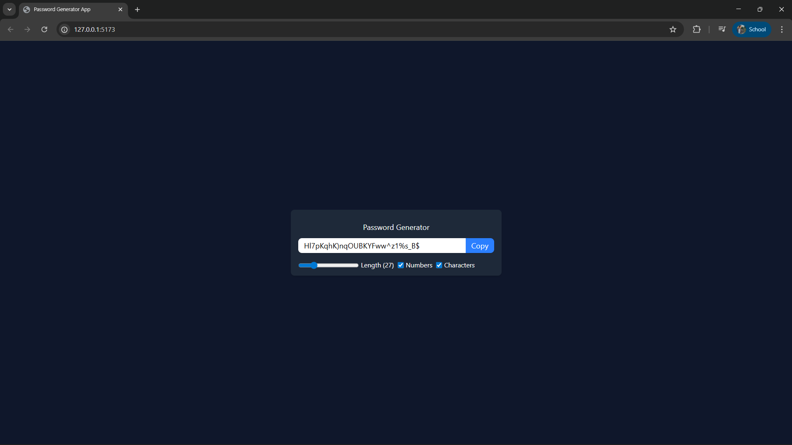

🔑 Password Generator App

A simple and responsive Password Generator built with React and Tailwind CSS.
It allows users to generate strong random passwords with customizable length, numbers, and special characters.

🚀 Features

Generate secure passwords instantly.

Adjustable password length (6–100).

Option to include numbers and special characters.

One-click copy to clipboard functionality.

Responsive and modern UI with Tailwind CSS.

Built using React hooks: useState, useEffect, useCallback, and useRef.

🛠️ Tech Stack

React (Vite/CRA) – for building the UI

Tailwind CSS – for styling

JavaScript (ES6+) – logic & hooks

📸 Screenshot

⚡ Getting Started

Clone the repository:

git clone https://github.com/your-username/password-generator.git
cd password-generator

Install dependencies:

npm install

Start the development server:

npm run dev

Open in browser:

http://localhost:5173

📂 Folder Structure
src/
│── App.jsx        # Main app component
│── main.jsx       # Entry point
│── index.css      # Tailwind styles
